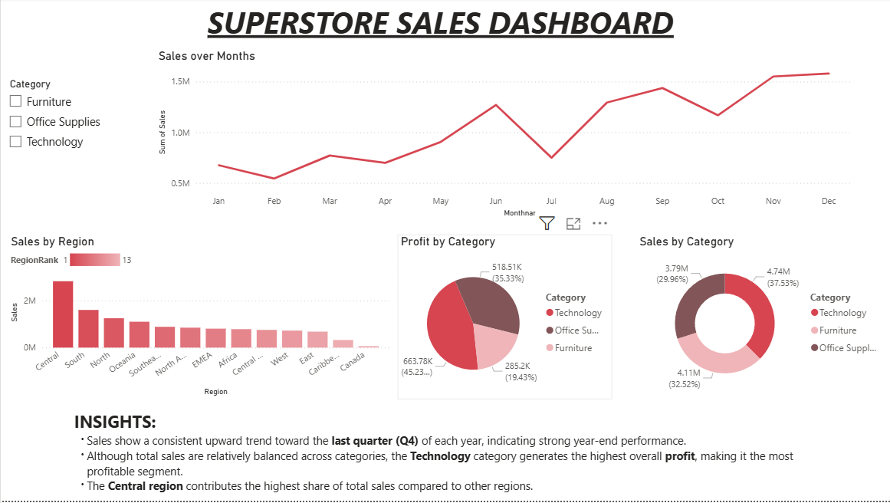

# 📊 Superstore Sales Dashboard

### 🎯 Objective
To design an interactive dashboard that visualizes sales performance by **month, region, and product category** using Power BI.

---

## 🛠 Tools Used
- Power BI  

---

## 📁 Dataset Description

The dataset includes the following columns:

- Order Date  
- Region  
- Category  
- Sales  
- Profit  

## 📊 Dashboard Features

The dashboard consists of:

- 📈 **Line Chart:** Sales over Months  
- 📊 **Bar Chart:** Sales by Region  
- 🍩 **Donut Chart:** Sales by Category  
- 🥧 **Pie Chart:** Profit by Category  
- 🎛 **Slicer:** Category filter for interactive analysis  

---

## 🔍 Key Insights

- Sales show a consistent upward trend toward the last quarter (**Q4**) of each year, indicating strong year-end performance.
- Although total sales are relatively balanced across categories, the **Technology** category generates the highest overall profit.
- The **Central region** contributes the highest share of total sales compared to other regions.

---

## 📷 Dashboard Preview

---

## 🚀 Outcome

This dashboard provides a clear overview of:
- Monthly sales trends  
- Regional sales distribution
- Category-wise profitability  

It helps identify seasonal demand patterns and top-performing business segments.

---
